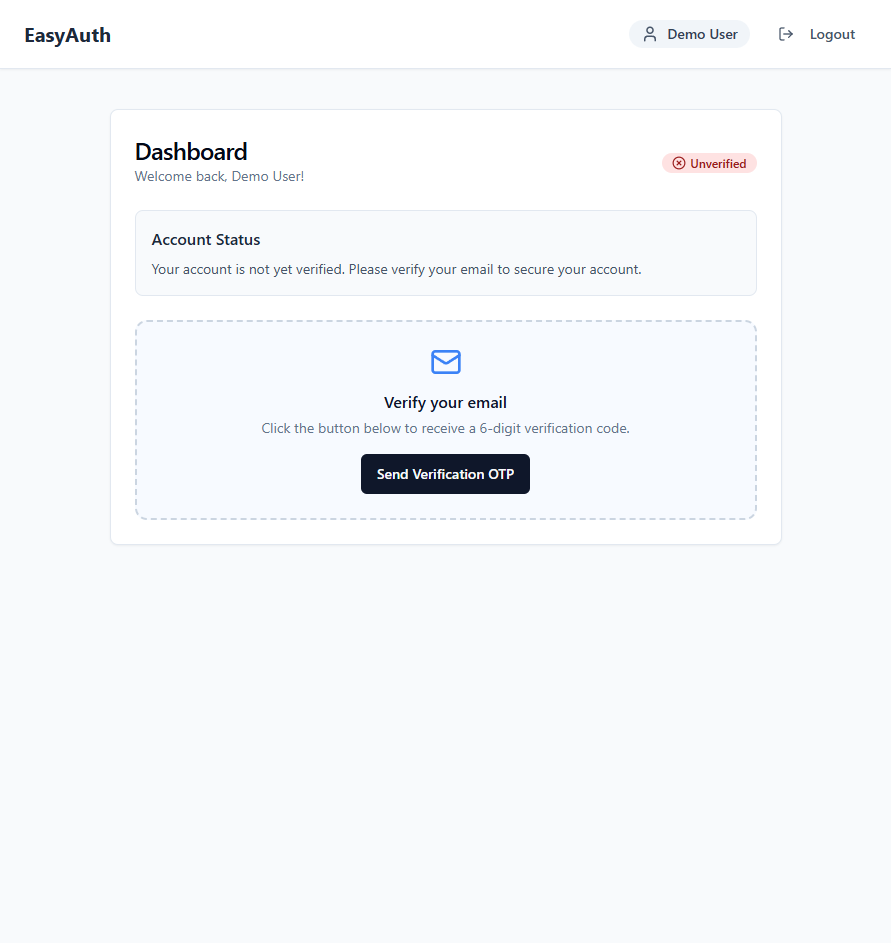

# Easy MERN Auth 🛡️



A professional, full-stack authentication starter kit built with the MERN stack (MongoDB, Express, React, Node.js). This project provides a robust foundation for secure user management, featuring email verification and password recovery.

## 🚀 Features

-   **Full Authentication Workflow**: Secure registration, login, and logout.
-   **Email Verification**: OTP-based account verification via Nodemailer.
-   **Password Recovery**: Secure "Forgot Password" flow with email OTP and password reset.
-   **State Management**: Lightweight and fast global state handling with Zustand.
-   **Modern UI/UX**: Built with React, Vite, Tailwind CSS, and Shadcn UI for a polished, responsive interface.
-   **Security First**:
    -   Password hashing with `bcryptjs`.
    -   JWT-based authentication.
    -   Secure, HTTP-only cookie storage for tokens.
    -   **Protected API routes and frontend navigation guards.**

    ## 🖼️ UI Preview

    The application features a modern, clean, and fully responsive user interface:

    -   **Dashboard**: A centralized view showing account status with success/error badges.
    -   **Auth Forms**: Centered, card-based layouts for Login and Registration with real-time validation feedback.
    -   **Verification UI**: A specialized 6-digit OTP input interface for a seamless verification experience.
    -   **Responsive Design**: Optimized for mobile, tablet, and desktop viewing using Tailwind CSS's mobile-first approach.

    ## 🧪 Demo Mode (No Backend Required)

    For testing and demonstration purposes, the frontend is currently configured in **Demo Mode**. You can explore the entire UI and authentication flow without setting up a database:

    -   **Login Email**: `test@example.com`
    -   **Login Password**: `password123`
    -   **Verification OTP**: `123456`

    To disable Demo Mode and connect to your real backend, set `MOCK_MODE = false` in `frontend/src/store/authStore.js`.

    ## 📦 Getting Started

### Prerequisites
-   Node.js installed on your machine.
-   MongoDB Atlas account or local MongoDB instance.
-   SMTP credentials (e.g., Gmail, SendGrid, or Mailtrap) for email features.

### 1. Clone the repository
```bash
git clone https://github.com/rajjitlai/Easy_MERN_Auth.git
cd Easy_MERN_Auth
```

### 2. Backend Setup
```bash
cd server
npm install
```
Create a `.env` file in the `server` directory and add the following:
```env
PORT=8282
MONGO_URL=your_mongodb_connection_string
JWT_SECRET=your_jwt_secret
NODE_ENV=development

SMTP_HOST=your_smtp_host
SMTP_PORT=your_smtp_port
SMTP_USER=your_smtp_user
SMTP_PASS=your_smtp_password
SENDER_EMAIL=your_verified_sender_email
```
Start the server:
```bash
npm run server
```

### 3. Frontend Setup
```bash
cd ../frontend
npm install
```
Start the development server:
```bash
npm run dev
```

## 📂 Project Structure

```text
Easy_MERN_Auth/
├── server/               # Node.js Express Backend
│   ├── config/           # Database & Mailer configurations
│   ├── controllers/      # Business logic
│   ├── middleware/       # Auth guards
│   ├── models/           # Mongoose schemas
│   ├── routes/           # API endpoints
│   └── server.js         # Entry point
└── frontend/             # React Vite Frontend
    ├── src/
    │   ├── components/   # UI & Shared components
    │   ├── hooks/        # Custom React hooks
    │   ├── pages/        # Route-level components
    │   ├── store/        # Zustand state store
    │   └── lib/          # Utilities
    └── tailwind.config.js
```

## 📜 License

Copyright © 2026 **Rajjit Laishram**.

This project is licensed under the MIT License - see the LICENSE file for details.
